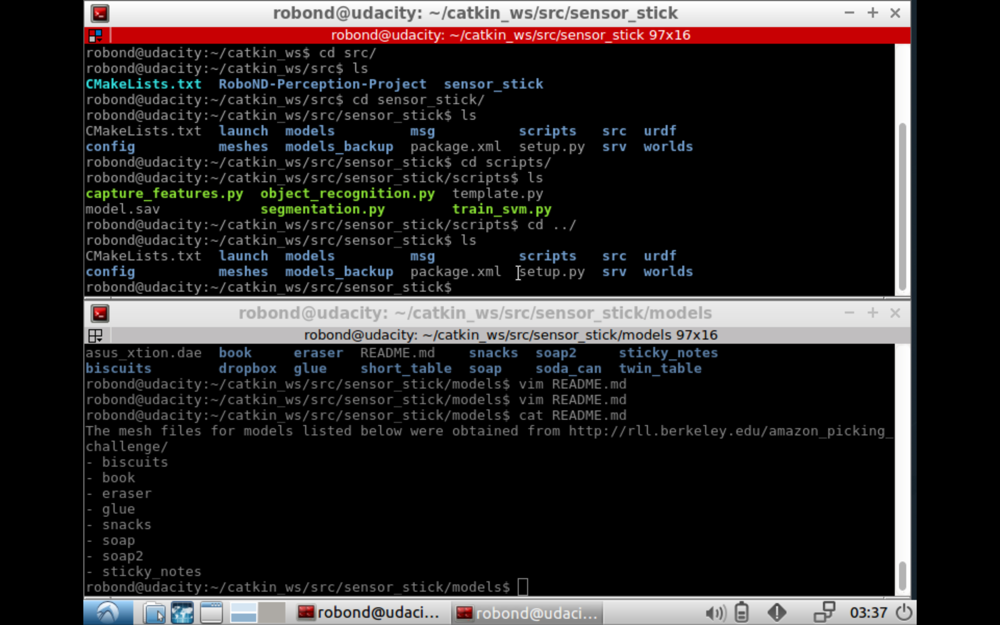
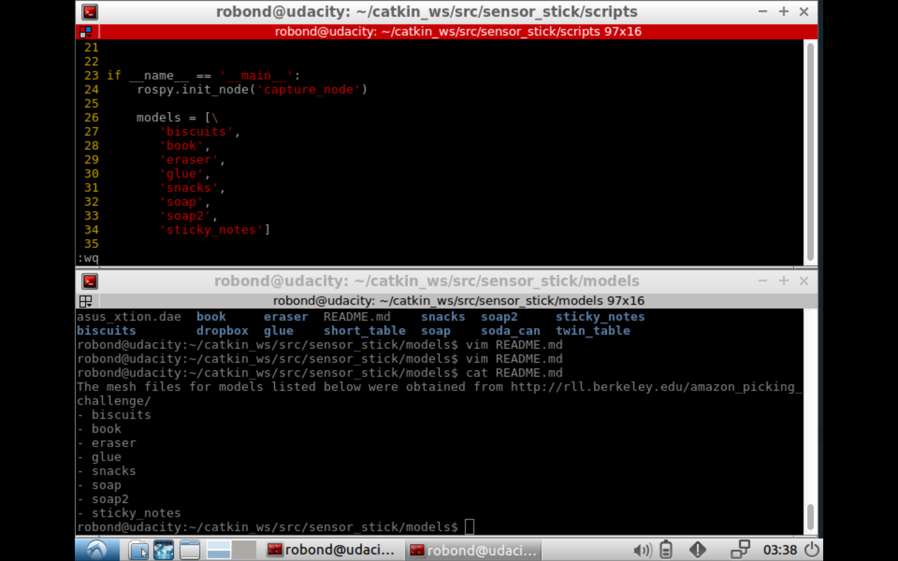

## Project: Perception Pick & Place
### Writeup Template: You can use this file as a template for your writeup if you want to submit it as a markdown file, but feel free to use some other method and submit a pdf if you prefer.

## previous Exercises
First of all, I've used the previous Exercise which is 'sensor_stick' Exercise.
  1. filtering RANSAC Exercise : https://www.youtube.com/watch?v=vt0QpQmOjto
    - In this project, passthrough filter should be two. I've realized there are two boxes one the left and right hand side. you should make a filter with y-axis
  2. Cluster Visulization : https://www.youtube.com/watch?v=xcQ5ySgGAMM
  3. Object Recognition : https://www.youtube.com/watch?v=bwYcwcsnXbU
  4. Train SVM : https://www.youtube.com/watch?v=GXwLPqTjkZ8
also contained in this repository

## Project, capture features
### first submit
To Train SVM in project. I've used the 'sensor_stick' project. I've changed models and capture features.

moving models folder from Project to sensor_stick (models_backup is for sensor_stick)

before capturing features, should change models list

  Train Project SVM : https://www.youtube.com/watch?v=dOeFrYC3-7Y
the accuracy was not that great. perhaps I should've looped more.

## Project, Object Recognition
copied from model.sav which I'd made before in sensor_stick to project script folder. and recognize. 

result outputs is in yaml folder
and images are below.

yaml_01

yaml_02

yaml_03

### second submit
changed several variables  and I have more accurate model.sav

second training.sav

second model.sav

REVIEW: 
1. To finish this project. what I could do was just reading. I've never learned like this. so, I sometimes used LIVE asking and just read lectures over and over.
2. To get better result. I could spend more time to capture features( more loop). that will make better model.sav and better result.

============================================================================
